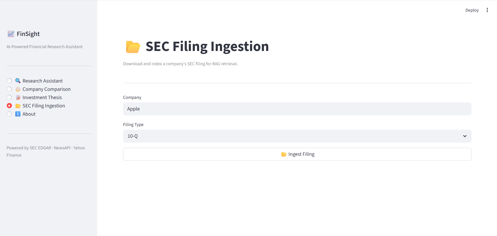
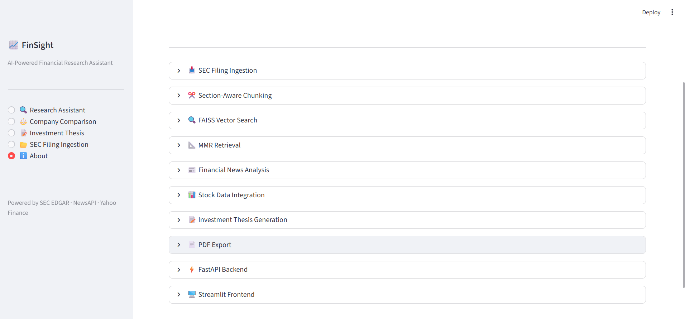

# FinSight 📈

**AI-Powered Financial Research Assistant**

FinSight is an end-to-end financial research platform that combines SEC filings, market data, financial news, Retrieval-Augmented Generation (RAG), and Large Language Models to help users perform company research, compare businesses, and generate structured investment theses.

---

## Features

### Conversational Financial Research

Ask natural language questions about public companies.

Examples:

* What are Apple's biggest risks?
* How does NVIDIA generate revenue?
* What growth opportunities does Microsoft have?

FinSight retrieves relevant information from SEC filings, financial news, and market data before generating grounded responses.

---

### SEC Filing Analysis

FinSight automatically:

* Downloads SEC filings
* Parses filing content
* Chunks documents
* Creates embeddings
* Stores vectors in FAISS

Supported filing types:

* 10-K
* 10-Q
* 8-K

---

### Retrieval-Augmented Generation (RAG)

The system uses:

* Section-aware document chunking
* HuggingFace Embeddings
* FAISS Vector Store
* MMR Retrieval
* Conversational Question Contextualization

This allows the assistant to answer questions using relevant filing excerpts instead of relying solely on LLM knowledge.

---

### Financial News Integration

Recent company news is incorporated into responses to provide context about:

* Product launches
* Partnerships
* Lawsuits
* Regulatory developments
* Market sentiment

---

### Stock Market Data Integration

FinSight retrieves live market information including:

* Current Price
* Market Capitalization
* PE Ratio
* EPS
* Revenue
* Net Income
* Dividend Yield
* Debt-to-Equity Ratio
* Return on Equity

---

### Company Comparison

Compare two companies side-by-side using:

* Financial metrics
* Recent developments
* SEC filing insights
* Business strengths and weaknesses

Example:

Compare Apple and Microsoft's long-term growth opportunities.

---

### Investment Thesis Generator

Generate structured research reports including:

* Executive Summary
* Business Overview
* Competitive Advantages
* Growth Drivers
* Financial Snapshot
* Recent Developments
* Bull Case
* Bear Case
* Key Risks
* Long-Term Outlook
* Conclusion

---

### PDF Export

Investment theses can be exported as professional PDF reports for later review and sharing.

---

## System Architecture

User

↓

Streamlit Frontend

↓

FastAPI Backend

↓

Research Pipeline

├── SEC Filing Retrieval

├── News Retrieval

├── Stock Data Retrieval

└── RAG Retrieval

↓

OpenRouter LLM

↓

Final Response

---

## Tech Stack

### Frontend

* Streamlit

### Backend

* FastAPI
* Pydantic

### LLM & AI

* OpenRouter
* LangChain

### RAG

* HuggingFace Embeddings
* FAISS
* MMR Retrieval

### Data Sources

* SEC Filings
* Yahoo Finance
* Financial News APIs

### PDF Generation

* ReportLab

---

## Project Structure

```text
FinanceResearchAssistant/

backend/
│
├── rag/
│   ├── ingestor.py
│   ├── retriever.py
│
├── tools/
│   ├── stock.py
│   ├── news.py
│   ├── filings.py
│
├── utils/
│   ├── ticker_lookup.py
│   ├── pdf_generator.py
│
├── agent.py
├── compare.py
├── thesis.py
├── main.py
├── schemas.py
├── llm.py
├── config.py
│
Frontend/
│
├── app.py
│
requirements.txt
README.md
```

---

## Installation

Clone the repository:

```bash
git clone <your-repo-url>

cd FinanceResearchAssistant
```

Install dependencies:

```bash
pip install -r requirements.txt
```

Create a `.env` file:

```env
OPENROUTER_API_KEY=your_key

NEWS_API_KEY=your_key

MODEL_NAME=your_model
```

---

## Running the Backend

```bash
cd backend

uvicorn main:app --reload
```

Swagger UI:

```text
http://localhost:8000/docs
```

---

## Running the Frontend

```bash
cd Frontend

streamlit run app.py
```

---

## API Endpoints

### Ingest SEC Filings

```http
POST /ingest
```

### Financial Research

```http
POST /query
```

### Company Comparison

```http
POST /compare
```

### Investment Thesis Generation

```http
POST /thesis
```

### PDF Export

```http
POST /thesis/pdf
```

---

## Example Workflow

1. Ingest Apple's latest 10-K.
2. Ask questions about risks and strategy.
3. Compare Apple and Microsoft.
4. Generate an investment thesis.
5. Export the report as a PDF.

---

## Future Improvements

* Multi-company portfolio analysis
* Historical financial trend analysis
* Advanced citation support
* Persistent vector databases
* Docker deployment
* Cloud deployment
* Real-time market monitoring

---

## Screenshots

<details>
<summary>📊 Research Assistant</summary>

<br>


<br>


</details>

<details>
<summary>⚖️ Company Comparison</summary>

<br>


<br>


<br>


</details>

<details>
<summary>📝 Investment Thesis</summary>

<br>


<br>


</details>

<details>
<summary>📂 SEC Filing Ingestion</summary>

<br>



</details>

<details>
<summary>ℹ️ About Page</summary>

<br>



</details>

## Disclaimer

This project is intended for educational and research purposes only.

It does not constitute financial or investment advice.
